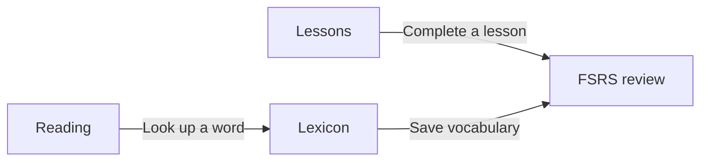

# Flyt — learn Norwegian through lessons, reading, and review

[](https://github.com/Chalvin96/flyt/actions/workflows/master.yml)
[](LICENSE)

Flyt connects structured lessons, Norwegian reading, dictionary lookup, and
FSRS spaced repetition. Finish a lesson to add its concepts to review, or save
an unfamiliar word while reading to practise it later.

**[Open Flyt](https://flyt.umebocchi.my.id)** ·
[Local setup](CONTRIBUTING.md) ·
[Privacy](https://flyt.umebocchi.my.id/about#privacy)

## What you can do

- **Learn with lessons.** Work through a CEFR-organised curriculum with teaching
  steps and interactive exercises. Completed lessons enrol their concept pools
  in review.
- **Review what you learn.** FSRS schedules each concept, with rotating card
  variants and progress derived from your review history.
- **Read Norwegian.** Read curated stories, import articles, or generate stories
  using vocabulary from your learning activity. Tap words for lookup and save
  them to your cards.
- **Explore the dictionary.** Look up lemmas, definitions, inflections, and
  pronunciation from imported Ordbokene data enriched by the companion
  [norsk-lemma](https://github.com/Chalvin96/norsk-lemma) pipeline.
- **Use FlytLese in the browser.** The Chromium extension supports word lookup,
  text translation, saving vocabulary, and article import. Chrome and Edge
  store listings are not published yet; Firefox and Safari are not supported.
- **Ask for help.** The chatbot uses your message and current page context;
  available AI and speech features depend on the deployment's provider setup.



## Run locally

You need Python **3.12–3.13**, [uv](https://docs.astral.sh/uv/), Node **24+**,
**pnpm 12** (the exact version is pinned in `package.json`), PostgreSQL **16**,
and Redis. Python 3.14 is currently unsupported by the locked spaCy dependency.
Docker is needed for the isolated end-to-end test runners.

From a checkout of this repository:

```bash
pnpm install --frozen-lockfile
cp backend/.env.example backend/.env
cp frontend/.env.example frontend/.env.local
```

Follow **[CONTRIBUTING.md](CONTRIBUTING.md#running-the-stack)** to configure the
backend environment, create the local database, install Python dependencies and
the Norwegian spaCy model, and apply migrations. Generate real signing and
provider-encryption keys before starting the API; the example environment is a
template. The guide also explains local login without Google OAuth and disabling
or stubbing story generation when no provider key is available.

Once setup is complete, run each process in its own terminal:

```bash
# API
uv run --directory backend uvicorn flyt.main:app --reload

# Reading/background jobs
uv run --directory backend arq flyt.worker.WorkerSettings

# Web app
pnpm --filter frontend dev
```

Open the frontend at `http://localhost:5173`. Dictionary and lesson content are
separate release artifacts: migrations create the schema, and the
[import commands](CONTRIBUTING.md#loading-data-lessons-dictionary-reading-stories)
load the learning content.

## Development and checks

[CONTRIBUTING.md](CONTRIBUTING.md) covers environment variables, content imports,
isolated backend tests, end-to-end tests, hooks, and operations. Useful checks
from the repository root include:

```bash
pnpm spec:validate
pnpm --filter frontend lint
pnpm --filter frontend type-check
pnpm --filter frontend test --run
pnpm --filter @flyt/extension test
```

Backend tests create and drop their schema; use the dedicated PostgreSQL and
Redis setup in [the testing guide](CONTRIBUTING.md#tests). The Playwright runners
`bash scripts/run_e2e.sh` and `bash scripts/run_extension_e2e.sh` create an isolated
Compose stack, seed fixtures, and clean up their containers and volumes.

Pull requests and `master` share [the CI workflow](.github/workflows/_ci.yml),
which checks backend lint, formatting, types, tests, and migration drift;
frontend generated API types, lint, formatting, types, build, unit tests, and
Storybook browser tests; extension types, tests, and build; and security scans.
See the workflow for the complete gates and
[the contribution conventions](CONTRIBUTING.md#conventions) before submitting
changes.

## Architecture

| Area                                | Stack / responsibility                                          |
| ----------------------------------- | --------------------------------------------------------------- |
| `backend/`                          | Python, FastAPI, async SQLAlchemy, Alembic, PostgreSQL, FSRS    |
| `frontend/`                         | React 19, TypeScript, Vite, TanStack Router/Query, Tailwind CSS |
| `extension/`                        | Chromium Manifest V3 extension                                  |
| `packages/ui/`, `packages/lexicon/` | Shared UI and dictionary components                             |
| Background worker                   | arq and Redis for imports and generation                        |
| `morph-svc/`, `stt-svc/`            | Optional morphology fallback and private speech transcription   |

PostgreSQL owns durable content, learner progress, and accounting. Redis holds
transient coordination and generated text. Review scheduling belongs to a
concept pool, while card payload snapshots keep later dictionary edits from
rewriting existing questions. Lessons and dictionary data arrive as versioned
releases from their producer repositories.

Read [system architecture](knowledge/architecture/system.md),
[architecture decisions](knowledge/architecture/decisions.md), and the owning
concepts in `knowledge/` for the current engineering boundaries.

## Hosting and privacy

The hosted app uses Google Sign-In. Its
[privacy policy](https://flyt.umebocchi.my.id/about#privacy) describes account and
learning data, external AI processing, error monitoring, and data requests.
Story generation can send selected vocabulary and story instructions to a
configured provider. Chatbot requests can send messages, recent history, and
page context to the selected provider. Account deletion is available in the app.

For self-hosting, [CONTRIBUTING.md](CONTRIBUTING.md#optional-services-and-operations)
covers migrations, the separate worker, readiness, recovery, and configuration.
Application images publish to GHCR after CI on `master`; deployment is managed
outside this repository. Optional services have their own
[morphology](morph-svc/README.md) and [speech](stt-svc/README.md) deployment guides.
Authentication boundaries are documented in
[auth and API](knowledge/architecture/auth-and-api.md), and credential rotation in
[ChatGPT link operations](knowledge/operations/chatgpt-link.md).

## Attribution

Dictionary data is derived from **Bokmålsordboka / Nynorskordboka** and used under **CC BY 4.0**:

> Bokmålsordboka/Nynorskordboka, Universitetet i Bergen og Språkrådet, ordbøkene.no, CC BY 4.0.

- License: <https://creativecommons.org/licenses/by/4.0/>
- Ordbøkene open data: <https://ordbokene.no/nob/about/open-data>
- Citation guide: <https://ordbokene.no/nob/help/cite>

The data is fetched, enriched, and packaged by the companion repo
[**norsk-lemma**](https://github.com/Chalvin96/norsk-lemma). English glosses are
LLM-generated and may contain errors; they are a learning aid, not an authoritative
translation of the source dictionaries.

Frequency ranking for the word-pack decks is derived from the **Norwegian Kelly
list** (Universitetet i Oslo, Tekstlaboratoriet), used under **CC BY-SA 4.0**:

> Norwegian Kelly list, UiO Text Laboratory (tekstlab.uio.no/kelly), CC BY-SA 4.0.

- License: <https://creativecommons.org/licenses/by-sa/4.0/>

The private [CPU speech service](stt-svc/README.md) uses the Apache-2.0
NB-Whisper Medium model and MIT-licensed faster-whisper/CTranslate2 runtime.
Model provenance and distributed license text are listed in
[`stt-svc/NOTICE.md`](stt-svc/NOTICE.md). Browser clients use the
authenticated backend proxy; the frontend does not ship a model runtime.

## License

The application source code is licensed under the **[MIT License](LICENSE)** — free to
use, modify, and build on, including commercially, as long as the copyright notice is
retained.

The bundled dictionary and frequency **data** are licensed separately by their original
authors (CC BY 4.0 / CC BY-SA 4.0) and are not covered by the MIT license — see
[Attribution](#attribution) above and [`LICENSE`](LICENSE) for the notices.
